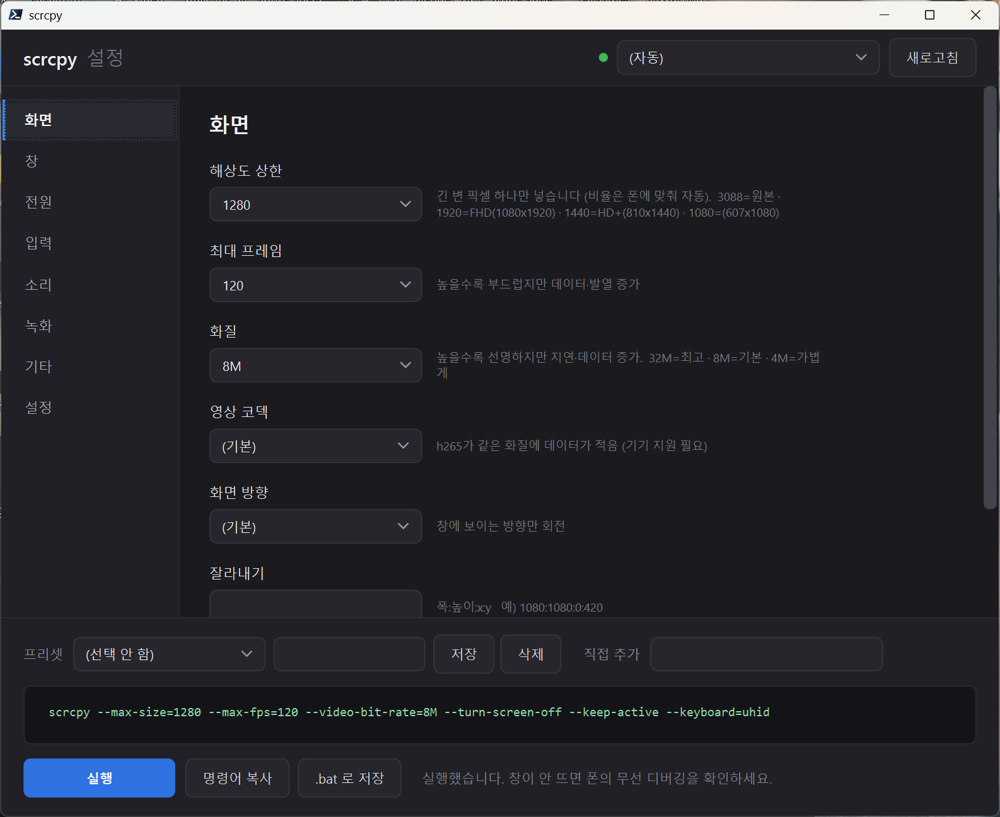

# scrcpy 설정 GUI

Windows에서 **안드로이드 폰을 PC 화면으로 조작**할 때 쓰는 [scrcpy](https://github.com/Genymobile/scrcpy)의 설정 창입니다.
scrcpy는 옵션이 100개가 넘는데 전부 명령줄로 넣어야 해서, 그걸 화면에서 고르게 만든 것입니다.

scrcpy 자체를 대체하지 않습니다. **옵션을 조립해서 실행해주는 얇은 창**입니다.

> 현재 베타: **v0.1.3-beta**



왼쪽에서 범주를 고르고, 하단에서 **실행될 명령어**를 바로 확인합니다. 이 예시는
`화면 끄고 PC로 사용`이 반영된 `--turn-screen-off --keep-active` 미리보기입니다.

---

## 필요한 것

| | 최소 | 비고 |
|---|---|---|
| Windows | 10 / 11 | |
| PowerShell | **7 이상** (`pwsh`) | [설치](https://github.com/PowerShell/PowerShell/releases) · Windows 기본 PowerShell 5.1로는 안 됩니다 |
| scrcpy | 공식 최신 Windows 64비트 ZIP | Android 16 폰이면 **4.0 이상 필요** (그 미만은 크래시) |
| adb | platform-tools | scrcpy 공식 배포판에 대부분 같이 들어 있습니다 |
| 폰 | Android 5.0+ | 무선으로 쓰려면 **Android 11+** |

## 실행

```
scrcpy-gui.bat
```

시작 BAT는 PowerShell 7의 표준 설치 경로를 먼저 확인하고 `PATH`를 마지막으로 확인합니다.
따라서 PowerShell 7을 설치한 뒤 Windows 탐색기가 이전 `PATH`를 유지하고 있어도 실행됩니다.
PowerShell 7 자체를 찾지 못하면 설치가 필요하다는 안내를 표시하므로, 안내의 링크에서 설치한 뒤 BAT를 다시 실행하세요.

`scrcpy.exe`와 `adb.exe`는 **자동으로 찾습니다.** 찾아보는 곳:

1. `설정` 탭에서 직접 지정한 경로
2. 이 스크립트와 같은 폴더 (scrcpy 폴더에 통째로 넣어 쓰는 경우)
3. `PATH`
4. 흔한 설치 위치 — winget · scoop · chocolatey · `Program Files` · `Downloads` · `C:\app`

> **여러 버전이 깔려 있으면 버전이 가장 높은 것을 고릅니다.**
> 순서만으로 고르지 않는 이유: 예전에 깐 구버전이 `PATH`에 남아 있는 경우가 흔하고,
> 그걸 집으면 최신 안드로이드에서 그냥 죽습니다.

못 찾으면 창은 그대로 뜨고 하단에 안내가 나옵니다. **왼쪽 `설정` 탭**에서 다음 중 하나를 고르세요.

1. **공식 최신 버전 설치** — Genymobile의 공식 GitHub 최신 정식 릴리스에서 Windows 64비트 ZIP만 받습니다.
   다운로드 전에 버전·파일 크기·출처·SHA-256·설치 경로를 보여주며, `예`를 눌러야 시작합니다.
   먼저 설치 폴더를 직접 고를 수 있습니다. 비워두거나 바꾸지 않으면 `%LOCALAPPDATA%\scrcpy-gui\scrcpy\<버전>`의 새 폴더에 풀고, 기존 설치는 덮어쓰지 않습니다.
2. **찾아보기** — 이미 설치한 `scrcpy.exe` 또는 `adb.exe`를 직접 지정합니다.

설치 또는 직접 지정한 경로는 `scrcpy-gui-config.json`에 저장돼서 다음부터 기억합니다. 설치만으로는 scrcpy를 실행하지 않으며, 하단 **실행** 버튼을 눌러야 폰 연결을 시작합니다.

설정 탭의 **설치 안내 열기** 버튼을 누르면 [설치 안내 페이지](scrcpy-install-guide.html)가 기본 브라우저로 열립니다.
공식 출처·설치 경로·SHA-256 검증·무선 페어링·입력 캡처 탈출법을 한 화면에서 확인할 수 있으며,
안내를 여는 것만으로는 설치·다운로드·폰 연결이 시작되지 않습니다.

> 보안: scrcpy 공식 저장소는 `Genymobile/scrcpy`뿐입니다. 이 GUI도 그 GitHub Releases API와 정확히 일치하는 다운로드 URL만 사용하며, URL 입력·제3자 미러·자동 백그라운드 업데이트는 제공하지 않습니다.

---

## 처음 한 번만: 무선으로 연결하기 (Android 11+)

USB 케이블 없이 쓰려면 최초 1회 페어링이 필요합니다. **이 페어링은 폰에 저장돼서 재부팅해도 유지됩니다.**

1. 폰: `설정` → `개발자 옵션` → **무선 디버깅** 켜기
2. `무선 디버깅` 글자를 눌러 들어가서 → **`페어링 코드로 기기 페어링`**
3. 팝업에 뜬 `IP:포트`와 6자리 코드로 PC에서:
   ```
   adb pair 192.168.0.5:41234 123456
   ```
4. 끝. 이후에는 `adb devices` 만 실행하면 mDNS로 **자동 연결**됩니다.

> ⚠️ `adb tcpip 5555` 방식은 쓰지 마세요. **전환 자체에 USB 연결이 필요하고**, Wi-Fi가 끊기거나
> 폰을 재부팅하면 풀려서 다시 케이블을 꽂아야 합니다. 무선 디버깅 페어링에는 그 문제가 없습니다.
>
> ⚠️ 무선 디버깅은 **재접속마다 포트가 바뀝니다.** `IP:5555` 를 고정해두는 방식은 동작하지 않습니다.
>
> ⚠️ 폰을 재부팅하면 무선 디버깅 **토글이 꺼집니다**(기기에 따라 다름). 퀵설정 타일에 추가해두면 1탭으로 켤 수 있습니다.

---

## 한글이 입력되지 않을 때

scrcpy 기본 모드는 키 코드만 보내서 폰의 입력기(IME)를 거치지 않습니다. 그래서 한글이 안 됩니다.

1. `입력` 탭 → **키보드 방식 = `uhid`** (기본값으로 설정돼 있음)
2. **폰 기본 키보드를 확인하세요.** 물리 키보드 처리가 부실한 키보드 앱이 있습니다.
   삼성 폰이면 **삼성 키보드**를 권장합니다.
   ```
   adb shell ime list -s                                   # 설치된 키보드 목록
   adb shell ime set <위 목록에서 고른 것>                    # 기본 키보드 변경
   ```
3. 한/영 전환은 **입력칸에 커서를 놓은 상태에서** `Shift+Space` (또는 `Ctrl+Space`, `Alt+Shift`).
   입력칸 밖에서 누르면 아무 반응이 없습니다 — 고장이 아닙니다.

**증상으로 원인 찾기**: 숫자는 들어가는데 **알파벳만 안 들어가면** 키보드 앱 문제입니다.
숫자는 IME를 거치지 않고 들어가고 알파벳만 IME가 가로채기 때문입니다.

물리 키보드를 쓸 때 폰 화면 자판이 뜨는 게 거슬리면 → `입력` 탭의 **폰 화면 자판 표시** 토글을 끄세요
(폰 설정을 직접 바꿉니다. 바꾸기 전에 확인창이 뜨며, 되돌리려면 다시 켜면 됩니다).

`입력` 탭에서 **마우스 방식 = `uhid` 또는 `aoa`**를 고르면 마우스가 창에 캡처될 수 있습니다.
빠져나오려면 **`Alt` 또는 Windows 키**를 누르세요. 다시 누르면 재캡처됩니다.

---

## 폰 화면을 끄고 PC로 쓰기

`전원` 탭의 **화면 끄고 PC로 사용**만 켜면 됩니다. GUI가
`--turn-screen-off --keep-active`를 함께 넣어, 폰의 물리 화면은 끄고 PC 제어는 유지합니다.

- 이 모드에서는 **충전 중 활성 유지**와 **화면 자동 꺼짐 시간**을 자동으로 해제·비활성화합니다.
  모드를 끄면 이전 선택을 되돌립니다.
- 조작이 필요한 기능이므로 `입력` 탭의 **보기 전용**은 함께 선택할 수 없습니다.
  직접 추가 인자에 `--no-control` 또는 `-n`을 넣은 경우에도 실행·배치 파일 생성을 막습니다.
- 폰의 **물리 전원 버튼**을 누르면 화면이 다시 켜집니다.

---

## 화면이 너무 길쭉할 때

요즘 폰은 20:9 안팎이라 가로 모니터에 세로로 띄우면 매우 깁니다. **폰 화면 그대로라 정상입니다.**

가로로 넓게 쓰고 싶으면 `화면` 탭 → **가로 화면 (16:9)** 에서 `1920x1080` 을 고르세요.
폰 안에 **PC 모니터 비율의 화면을 새로 만들어** 띄웁니다. 폰 본체 화면과 독립적으로 돌아갑니다.

---

## 설정이 저장되는 방식

| 파일 | 무엇 | 언제 |
|---|---|---|
| `scrcpy-gui-config.json` | scrcpy·adb 실행 파일 위치와 공식 설치 폴더 | `설정` 탭에서 경로를 바꿀 때 |
| `scrcpy-gui-presets.json` | 이름 붙여 고르는 프리셋 | `저장` 버튼을 누를 때 |
| `scrcpy-gui-last.json` | 마지막으로 쓰던 값 | **창을 닫을 때 자동** → 다음 실행 시 복원 |

셋 다 스크립트와 같은 폴더에 생깁니다. 지워도 됩니다(기본값으로 돌아갑니다).

> 작업관리자로 강제 종료하면 마지막 값이 저장되지 않습니다. 창 X 버튼으로 닫아야 합니다.

---

## 옵션 추가하기

`scrcpy-gui.ps1` 맨 위의 `$OPTIONS` 표에 **한 줄만 넣으면** 화면에 항목이 생깁니다.

```powershell
@{ Group='화면'; Key='내옵션'; Label='보일 이름'; Type='text'; Default=''; Arg='--어쩌구={0}'; Hint='설명' },
```

| `Type` | 화면에 나오는 것 |
|---|---|
| `text` | 입력칸 |
| `check` | 토글 스위치 |
| `combo` | 목록에서 고르기 |
| `editcombo` | 목록 + 직접 입력 |
| `phonepref` | 폰 설정을 adb로 즉시 바꾸는 토글 (확인 후 적용, scrcpy 명령어에는 안 들어감) |
| `path` | 실행 파일 경로 + 찾아보기 |

---

## 라이선스·출처

- 이 프로젝트: **MIT** ([LICENSE](LICENSE))
- scrcpy © Genymobile — [Apache-2.0](https://github.com/Genymobile/scrcpy/blob/master/LICENSE).
  이 저장소는 scrcpy를 **포함하지 않고 실행만** 합니다. scrcpy는 따로 받아야 합니다.
